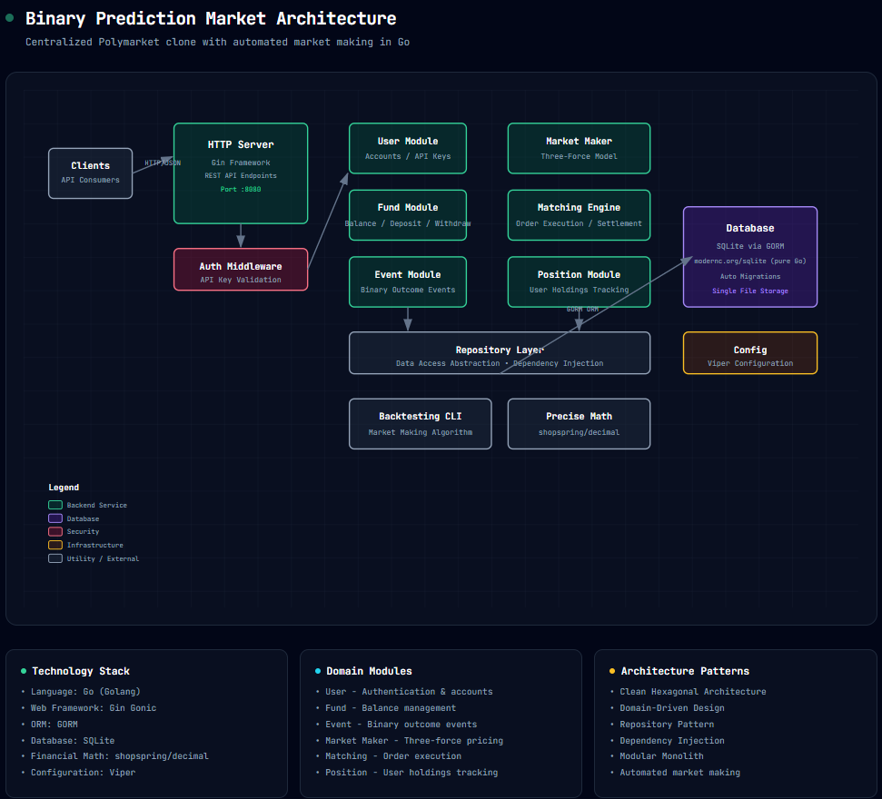
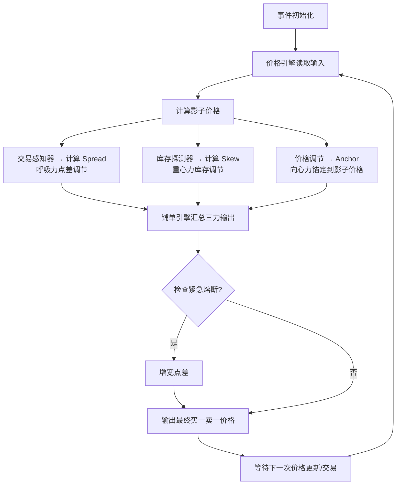

# Binary Prediction Market - 二元预测交易市场

> 基于三力模型做市算法的二元结果预测交易市场 MVP，Go 语言纯后端实现。

## 项目概述

对标 [Polymarket](https://polymarket.com/)，中心化 MVP 版本，平台自营做市，Go 语言开发，纯 API 后端。

### 项目目标
- 提供二元结果预测交易市场
- 内置基于**三力模型**（Spread/Anchor/Skew）的自动化做市算法
- 用户可以买卖份额，事件结束后结算提现
- 控制做市商库存风险，赚点差收益

### 范围边界
- ✅ 中心化 MVP（不上链）
- ✅ 仅支持二元结果事件
- ✅ 平台自营做市
- ✅ 纯 REST API 后端
- ✅ 纯 Go SQLite（不需要 CGO）
- ❌ 暂不支持多元/连续型事件
- ❌ 暂不支持第三方做市商入驻
- ❌ 暂不支持 Web 前端
- ❌ 暂不支持跨事件对冲

## 架构设计

### 整体架构图



### 架构风格：模块化单体
- 按领域模块划分代码，保持清晰边界
- 单进程部署，简化运维
- 模块间通过接口通信，后续可拆分

### 项目结构
```
golang-claude/
├── cmd/
│   ├── server/           # API 服务入口
│   └── backtest/         # 回测命令行工具
├── pkg/
│   ├── event/            # 事件管理模块
│   ├── market/           # 做市核心模块（三力算法）
│   ├── user/             # 用户管理 + API Key 认证
│   ├── fund/             # 资金账户管理
│   ├── position/         # 用户持仓管理
│   ├── matching/         # 撮合引擎 + 结算
│   ├── api/              # HTTP API 接口 + Handlers
│   └── common/           # 公共工具（Decimal、Config、Error、Response）
├── configs/              # 配置文件
├── docs/                 # 设计文档
├── tests/                # 集成测试
└── go.mod
```

## 核心模块职责

### event 模块
- 事件 CRUD 管理
- 事件状态流转（`PENDING` → `TRADING` → `SETTLED`）
- 事件结果结算

### market 模块（做市核心）

**整体架构流程图：**

```mermaid
flowchart TD
    A[事件初始化] --> B[资金调度模块]
    A --> C[风险控制模块]
    A --> D[价格引擎]

    D --> E[影子价格]
    E --> F[价格调节<br>(向心力 Anchor)]

    B --> G[交易感知器]
    G --> H[点差调节<br>(呼吸力 Spread)]

    C --> I[库存探测器]
    I --> J[库存调节<br>(重心力 Skew)]
    
    H --> K[铺单引擎<br/>紧急熔断]
    F --> K
    J --> K
    
    K --> L[挂单]
    K --> M[撤单]
    
    L & M --> D
    
    N[回测工具] --> K
```

**价格引擎**
- 计算影子价格（理论最优价格）
- 响应外部价格更新

**三力调节器**

| 力 | 名称 | 作用 | 公式/规律 |
|---|------|------|-----------|
| **Spread** | 呼吸力 | 点差调节 → 根据流动性、事件周期调整点差 | `spread = base_spread * (1 + time_multiplier)` <br/>事件越临近，点差越大 |
| **Anchor** | 向心力 | 价格锚定 → 拉向影子价格 | 让实际价格不偏离理论价格太远 |
| **Skew** | 重心力 | 库存调节 → 控制风险 | `Skew = base_skew + α * Inventory_Ratio + β * (1 - Event_Probability) + γ * Liquidity_Factor` <br/>库存越偏斜，Skew 越大，价格调整吸引反向交易 |

**铺单引擎**
- 汇总三力调节，输出最终买/卖价格
- 紧急熔断：波动率超过阈值时，增宽点差
- 生成挂单/撤单决策

### matching 模块
- 撮合用户订单与平台做市商
- 扣减资金，更新平台库存，更新用户持仓
- 处理结算和 payouts

### user 模块
- 用户账户创建
- API Key 认证中间件

### fund 模块
- 余额查询
- 充值/提现
- 订单资金扣减/释放
- 结算打款

### position 模块
- 用户持仓记录
- 按事件查询持仓

### api 模块
- REST API 端点定义
- 请求参数验证
- 统一响应格式
- API Key 认证中间件

## 做市算法流程



## 快速开始

### 环境要求
- Go 1.21+
- 不需要 CGO（使用 pure-go `modernc.org/sqlite`）

### 编译运行

```bash
# 克隆项目
git clone https://github.com/huinong/golang-claude.git
cd golang-claude

# 下载依赖
go mod tidy

# 运行服务器
go run ./cmd/server/main.go

# 服务器启动在 http://localhost:8080
```

### 运行回测

```bash
# 运行内置回测，模拟三力做市效果
go run ./cmd/backtest/main.go
```

示例输出：

```
Backtest setup complete:
  Event ID: 1
  Initial YES Price: 0.6000
  Initial YES Inventory: 1000
  Initial NO Inventory: 1000
  User balance: 10000

Market maker parameters:
  Base Spread: 0.0200
  Alpha (inventory coefficient): 0.30
  Beta (probability coefficient): 0.50
  Gamma (liquidity coefficient): 0.20

Initial quotation:
  YES Bid: 0.5800, YES Ask: 0.6200 (spread: 0.0400)
  NO Bid: 0.3700, NO Ask: 0.4100 (spread: 0.0400)

Trade 1: YES 100 shares
  Filled at price: 0.6200, total amount: 62.0000
  New YES Price: 0.6226, YES Inventory: 900
  New quotation YES: 0.6026 - 0.6426

...

Backtest complete:
  Final user balance: 9941.85
  Final YES Price: 0.6152
  PnL: -58.15
```

## REST API 完整文档

### 认证
所有用户请求需要在 Header 携带：
```
X-API-Key: <your-api-key>
```

### 响应格式
```json
{
  "success": true,
  "data": {},
  "message": ""
}
```

`success = false` 时，`message` 包含错误信息。

---

### 完整端点列表与使用示例

#### Public Routes（无需认证）

##### 1. 创建用户
```http
POST /api/v1/users
Content-Type: application/json

{
  "username": "your-username"
}
```

**示例：**
```bash
curl -X POST http://localhost:8080/api/v1/users \
  -H "Content-Type: application/json" \
  -d '{"username": "alex"}'
```

**响应：**
```json
{
  "success": true,
  "data": {
    "id": 1,
    "username": "alex",
    "api_key": "a1b2c3..."
  }
}
```

##### 2. 获取公开事件列表
```http
GET /api/v1/events
```
> 仅返回正在交易中的事件

##### 3. 获取所有事件（含已结算）
```http
GET /api/v1/events/all
```

##### 4. 获取事件详情 + 当前价格
```http
GET /api/v1/events/:id
```

**示例：**
```bash
curl http://localhost:8080/api/v1/events/1
```

---

### User Routes（需要认证）

##### 5. 获取账户信息
```http
GET /api/v1/user/account
X-API-Key: <api-key>
```

**示例：**
```bash
curl -H "X-API-Key: $API_KEY" http://localhost:8080/api/v1/user/account
```

**响应：**
```json
{
  "success": true,
  "data": {
    "user_id": 1,
    "balance": 10000.00
  }
}
```

##### 6. 充值
```http
POST /api/v1/user/deposit
X-API-Key: <api-key>
Content-Type: application/json

{
  "amount": 10000
}
```

**示例：**
```bash
curl -X POST http://localhost:8080/api/v1/user/deposit \
  -H "Content-Type: application/json" \
  -H "X-API-Key: $API_KEY" \
  -d '{"amount": 10000}'
```

##### 7. 买入份额
```http
POST /api/v1/trade/buy
X-API-Key: <api-key>
Content-Type: application/json

{
  "event_id": 1,
  "quantity": 10,
  "direction": "YES"
}
```

参数：
- `direction`: `YES` 或 `NO`

**示例：**
```bash
# 买入 10 份 YES
curl -X POST http://localhost:8080/api/v1/trade/buy \
  -H "Content-Type: application/json" \
  -H "X-API-Key: $API_KEY" \
  -d '{"event_id": 1, "quantity": 10, "direction": "YES"}'
```

##### 8. 卖出份额
```http
POST /api/v1/trade/sell
X-API-Key: <api-key>
Content-Type: application/json

{
  "event_id": 1,
  "quantity": 3,
  "direction": "YES"
}
```

---

### Admin Routes（需要认证，当前 MVP 任意用户可创建/管理事件）

##### 9. 创建事件
```http
POST /api/v1/admin/events
X-API-Key: <api-key>
Content-Type: application/json

{
  "title": "Will it rain tomorrow in Beijing?",
  "description": "Prediction for weather tomorrow",
  "start_time": "2026-04-16T00:00:00Z",
  "end_time": "2026-04-17T20:00:00Z",
  "initial_yes_price": 0.6,
  "initial_supply": 1000
}
```

参数：
- `initial_yes_price`: 0.01 ~ 0.99 之间
- `initial_supply`: 初始份额供应量

##### 10. 开始交易
```http
POST /api/v1/admin/events/:id/start
X-API-Key: <api-key>
```

状态从 `PENDING` → `TRADING`

##### 11. 结算事件
```http
POST /api/v1/admin/events/:id/settle
X-API-Key: <api-key>
Content-Type: application/json

{
  "result": "YES"
}
```

参数：
- `result`: `YES` 或 `NO`

> 结算后，所有持有对应结果份额的用户会按照 `1 份额 = 1 单位` 获得 payout，直接打到可用余额。

---

### 完整交易流程示例（curl）

```bash
# 1. 创建用户
curl -X POST http://localhost:8080/api/v1/users \
  -H "Content-Type: application/json" \
  -d '{"username": "trader"}'

# 保存返回的 API_KEY
export API_KEY="..."

# 2. 充值 10000
curl -X POST http://localhost:8080/api/v1/user/deposit \
  -H "Content-Type: application/json" \
  -H "X-API-Key: $API_KEY" \
  -d '{"amount": 10000}'

# 3. 创建事件
curl -X POST http://localhost:8080/api/v1/admin/events \
  -H "Content-Type: application/json" \
  -H "X-API-Key: $API_KEY" \
  -d '{
    "title": "Will Google beat Apple in Q2?",
    "description": "Prediction for Q2 earnings",
    "start_time": "'$(date -u +"%Y-%m-%dT%H:%M:%SZ" -d "+1 hour")'",
    "end_time": "'$(date -u +"%Y-%m-%dT%H:%M:%SZ" -d "+7 days")'",
    "initial_yes_price": 0.6,
    "initial_supply": 1000
  }'

# 保存事件 ID
export EVENT_ID=1

# 4. 开始交易
curl -X POST http://localhost:8080/api/v1/admin/events/$EVENT_ID/start \
  -H "X-API-Key: $API_KEY"

# 5. 查看事件信息
curl http://localhost:8080/api/v1/events/$EVENT_ID

# 6. 买入 20 YES
curl -X POST http://localhost:8080/api/v1/trade/buy \
  -H "Content-Type: application/json" \
  -H "X-API-Key: $API_KEY" \
  -d "{\"event_id\": $EVENT_ID, \"quantity\": 20, \"direction\": \"YES\"}"

# 7. 查看余额
curl -H "X-API-Key: $API_KEY" http://localhost:8080/api/v1/user/account

# 8. 结算事件（结果 YES）
curl -X POST http://localhost:8080/api/v1/admin/events/$EVENT_ID/settle \
  -H "Content-Type: application/json" \
  -H "X-API-Key: $API_KEY" \
  -d '{"result": "YES"}'

# 9. 查看最终余额（应包含 payout）
curl -H "X-API-Key: $API_KEY" http://localhost:8080/api/v1/user/account
```

## 运行测试

```bash
# 运行核心做市模块单元测试
go test ./pkg/market -v

# 运行所有测试（数据库测试需要 CGO）
go test ./...

# 运行集成测试（完整端到端测试，跳过当 CGO 不可用时）
go test ./tests/integration -v
```

## 技术选型

| 组件 | 选择 | 原因 |
|------|------|------|
| Web 框架 | Gin | 轻量、高性能、生态好 |
| ORM | GORM | 功能丰富，易用，支持 SQLite |
| 数据库 | SQLite | 单文件，适合 MVP，不需要额外服务 |
| 小数精度 | shopspring/decimal | 金融计算必须，避免浮点误差 |
| SQLite（纯 Go） | modernc.org/sqlite | 不需要 CGO，编译方便，跨平台 |

## 三力模型做市原理解释

### 1. 呼吸力（Spread）
- 事件刚创建时，点差较小，提供更好流动性
- 越临近结算，点差越大
- 原因：临近结算不确定性增加，做市商需要更大风险溢价

### 2. 向心力（Anchor）
- 市场价格始终锚定在初始概率（影子价格）附近
- 避免因为大单交易导致价格过度偏离合理水平
- 保持市场定价有效性

### 3. 重心力（Skew）
- 如果做市商库存中 YES 太多 → YES 价格上涨 → 鼓励用户卖出 YES 给做市商，买入 NO → 库存回归平衡
- 如果做市商库存中 NO 太多 → YES 价格下跌 → 鼓励用户买入 YES → 库存回归平衡
- 核心思想：通过价格激励自动平衡库存，控制做市风险

## 完整测试脚本

项目根目录提供：
- `api-test.sh` - Bash 完整测试脚本
- `api-test.ps1` - PowerShell 完整测试脚本（Windows）
- `API.md` - 单独的 API 文档

运行：
```bash
# 确保服务器已启动: go run ./cmd/server/main.go
bash api-test.sh
```

## 项目状态

- ✅ 所有核心功能完成
- ✅ 可编译运行（纯 Go，不需要 CGO）
- ✅ 核心算法单元测试通过
- ✅ 完整端到端集成测试
- ✅ 回测工具可用
- ✅ REST API 全部实现

## 未来改进方向

- [ ] 支持多元结果事件
- [ ] 支持多事件用户持仓查询 API
- [ ] 添加提现功能
- [ ] 真实管理员权限区分
- [ ] 添加速率限制
- [ ] 支持 WebSocket 实时价格推送
- [ ] 添加日志和监控
- [ ] 支持外部价格数据源对接

## License

MIT
